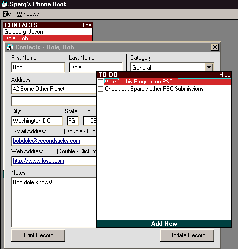



## Sparq's Personal Phonebook Version 2\.0\!\! Now with TO DO List\!\! MUST SEE\.

### Description

Sparq's Phonebook 2.0 - To Do list Added! Manage your contact's Address, Phone Number(s), URL, E-Mail address, Birthday AND MUCH MORE
 
### More Info
 

             |
---                |---
**Submitted On**   |2000-09-15 11:23:42
**By**             |[Sparq](https://github.com/Planet-Source-Code/PSCIndex/blob/master/ByAuthor/sparq.md)
**Level**          |Intermediate
**User Rating**    |5.0 (10 globes from 2 users)
**Compatibility**  |VB 6\.0
**Category**       |[Complete Applications](https://github.com/Planet-Source-Code/PSCIndex/blob/master/ByCategory/complete-applications__1-27.md)
**World**          |[Visual Basic](https://github.com/Planet-Source-Code/PSCIndex/blob/master/ByWorld/visual-basic.md)
**Archive File**   |[CODE\_UPLOAD99099152000\.zip](https://github.com/Planet-Source-Code/sparq-sparq-s-personal-phonebook-version-2-0-now-with-to-do-list-must-see__1-11493/archive/master.zip)

